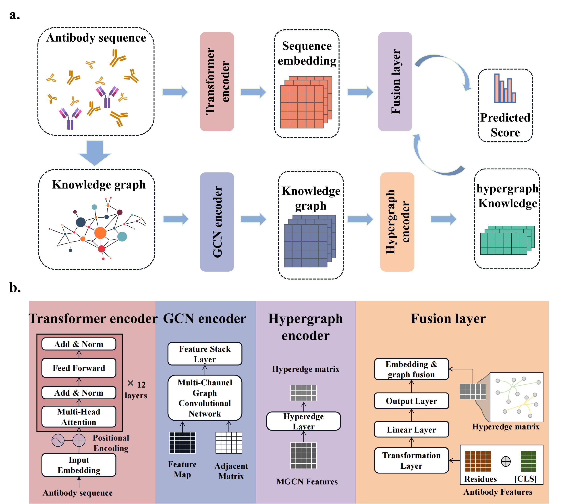

# AntiFormer

This code is prepared for "AntiFormer: graph enhanced large language model for binding affinity prediction".

## Overview

### Abstract
Antibodies play a pivotal role in immune defense and serve as key therapeutic agents. The process of affinity maturation, wherein antibodies evolve through somatic mutations to achieve heightened specificity and affinity to target antigens, is crucial for effective immune response. Despite their significance, assessing antibody-antigen binding affinity remains challenging due to limitations in conventional wet lab techniques. To address this, we introduce AntiFormer, a graph-based large language model designed to predict antibody binding affinity. AntiFormer incorporates sequence information into a graph-based framework, allowing for precise prediction of binding affinity. Through extensive evaluations, AntiFormer demonstrates superior performance compared to existing methods, offering accurate predictions with reduced computational time. Application of AntiFormer to SARS-CoV-2 patient samples reveals antibodies with strong neutralizing capabilities, providing insights for therapeutic development and vaccination strategies. Furthermore, analysis of individual samples following influenza vaccination elucidates differences in antibody response between young and older adults. AntiFormer identifies specific clonotypes with enhanced binding affinity post-vaccination, particularly in young individuals, suggesting age-related variations in immune response dynamics. Moreover, our findings underscore the importance of large clonotype category in driving affinity maturation and immune modulation. Overall, AntiFormer is a promising approach to accelerate antibody-based diagnostics and therapeutics, bridging the gap between traditional methods and complex antibody maturation processes.



## Installation
Download Antiformer:
```git clone https://github.com/wq2581/Antiformer```

Install Environment:
```pip install -r requirements.txt``` or ```conda env create -f environment.yml```

Our code is all based on python. In order to install dependencies please enter the project path ```./AntiFormer``` and activate your python environment.


## Running

### Train from scratch
   The codes for dataset creating are stored in the ```./AntiFormer/data``` directory. If you want to train from scratch, you need to start with data processing.
   
   (1) Ddownload the required data.
   ```bash
   $ cd /path/to/data
   $ python data_download.py
   ```
   
   (2) Get the frequency statistics. Of course, we also provide the results of frequency statistics saved as txt files in this directory.
   ```bash
   $ cd /path/to/data
   $ python data_process.py
   ```
   (3) Build the dataset.
   ```bash
   $ cd /path/to/data
   $ python dataset_making.py
   ```
   
   (4) Tokenize the input sequence
   ```bash
   $ cd /path/to/data
   $ python dt_rebuild.py
   ```
   
   (5) Run AntiFormer and get the prediction results.
   ```bash
   $ cd /path/to/AntiFormer
   $ python main.py
   ```
   
### From pre-trained model

   We also provide partially processed data (2000 sequences) as demo, located under the ```./AntiFormer/subdt``` path. And the pre-trained model can be accessed from [google drive](https://drive.google.com/file/d/1D-mkFwoJzu7E__vJc3ahnFE4UVGYz4_Q/view?usp=sharing). Please download the model and put it into ```./AntiFormer/model_save``` directory.
   However，if you have processed all the data, you can replace the ```./subdt``` path with your data path for training by . And be careful to change the hyperparameters in the ```main.py``` to suit your hardware and target.


## Quick start

If you want to use our model, you can download the pre-trained model from [google drive](https://drive.google.com/file/d/1D-mkFwoJzu7E__vJc3ahnFE4UVGYz4_Q/view?usp=sharing) and quickly test it using the antiboy sequence provided by the tutorial.

   
